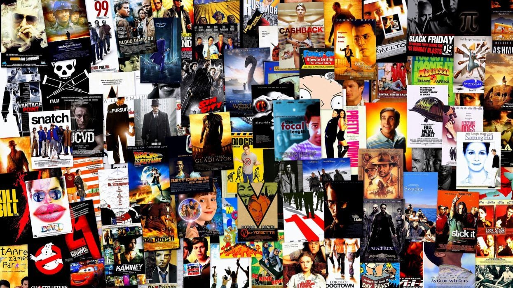

# Diversity Impact on Movie Success

## Datastory
Our project's Datastory can be accessed using this link: ([https://ovoland.github.io/ada-template-website/home](https://ovoland.github.io/ada-template-website/home))

## Abstract

The world is diverse, and so should cinema be to accurately represent us. Unfortunately, we still see problems arise when a more diverse cast is chosen. For example, when Halle Bailey, a black actress, was chosen as the Little Mermaid, word of boycotting emerged. Has this choice influenced the success of the movie, or is it just a loud minority? Our study delves into the influence of diversity on the success of films. By focusing on a wide range of movies from different genres, timestamps, and cultural backgrounds, we aim to provide insight into the correlation between cast diversity and movie success. The motivation behind our project is to reveal, perhaps, or predict whether a future movie will be successful based on the heterogeneity of its cast. This information can be useful for movie directors who are contemplating adding diverse crew members to their teams.

## Research Questions
In this research, we plan to address the following questions:
- To what extent does ethnicity (or gender) diversity in lead roles impact box office revenue?
- Does increased ethnic representation contribute to higher audience ratings?
- Do certain movie genres benefit more from specific types of diversity?
- Can we compute a “success” score based on different movie indicators?

## A Note on Ethical Risk
Our study is purely based on our curiosity to see whether having a diverse cast improves the overall movie experience for users; does it give the audience a more exciting and engaging experience?

However, although it is not our intention, we are aware that this analysis can be viewed as an ethical risk. For instance, we could end up with conclusions that may harm certain populations. Because of this, we have implemented a solution to arbitrarily group ethnicities into larger ethnic groups. This way, we cannot infer any conclusions about a specific population since they would be part of a much larger group.

Finally, we cannot stress enough that this project is in the scope of a data analysis course and is thus for **academic purposes**. Any potentially harmful result should be investigated significantly more closely and thoroughly in order to draw a meaningful conclusion.

## Proposed Additional Datasets
Since the CMU movie database contains limited amounts of information, we propose to expand our data using the full MovieLens Dataset found on Kaggle ([link](https://www.kaggle.com/datasets/rounakbanik/the-movies-dataset)). This 239 MB dataset contains metadata on a collection of 45000 movies and, as such, contains relevant data for our task. In particular, these include:
- Budget
- Box office revenue
- Movie runtime
- Vote average (the equivalent of user rating)

This dataset is not only useful for adding additional columns to our dataset (such as Budget or Vote average) but also helps in filling in missing information in existing columns (such as Box office revenue or Movie runtime). Adding the Kaggle dataset into our original dataset is relatively straightforward as we simply merge it according to the movie name and its release date.

## Methods
In order to address our questions, the main parts of our research are listed in the following:

### Step 1: Preprocessing of the Data
- CMU Movie Metadata
  - Changing the formatting of columns with dictionaries to lists
  - Changing “Movie release date” columns to datetime type and creating a new column with the extracted year
  - Remove movies released in 2013 as the data is incomplete for that year
  - Remove duplicated movies while conserving all the information
- Character Data
  - Remove actors whose ethnicity or gender is not specified
  - Remove actors from movies where their age is negative
  - Remove columns that aren’t of interest such as “Freebase Movie ID”

### Step 2: Ethnicity Exploration
- Extract the ethnicity Freebase IDs and get the name of each ethnicity
- Group ethnicities according to the UK’s list of ethnic groups

### Step 3: Feasibility analysis and first approaches to analysis
- Look at the size of the data after pre-processing
- Visualize the ethnic distributions both by considering unique actors and by the number of apparitions of each ethnicity (i.e. one actor is counted multiple times if they play in multiple movies)
- Visualize the distribution over time
- For each ethnic group visualize gender differences and the proportion of unnamed roles
- Visualize revenues under different considerations and perform first correlation and t-tests

### Step 4: Plot Summary Analysis
- Extract the main roles using the apparition of the names in the plot
- Analyze this under the light of ethnic and gender diversity
- Get the proportion of minor roles and perform similar analyses

### Step 5: Analyze Ratings and Revenues
- Match movies using propensity scores once for ratings and once for revenues
- Do statistical and causality analysis

### Step 6: Create a “success score”
- Once (non-)causality is established we can delve into the creation of a success score
- Decide on weights given ethnic gender variety, especially in leading roles
- Try to implement a machine learning task

### Step 7: Create the Data Story webpage
- Develop a cohesive and accessible Data Story webpage to communicate project findings.
- Generate interactive plots for more comfortable reading experience

## Timeline

- **up to 17.11.2023:** Steps 1 to 3
- **17.11.2023-01.12.2023:** Pause (Homework 2)
- **01.12.2023-08.12.2023:** Steps 4 and 5
- **08.12.2023-15.12.2023:** Step 6 and making sure the analyses are all well done
- **15.12.2023-22.12.2023:** Step 7 and final revision of all the previous steps

## Contributions within the team
This project was made possible thanks to the large efforts and commitments from each member. Many parts were treated together as a group but we list here the main contributions of each member in particular:
- Ali:
  - Processing and analysis on the gender across different ethnicities.
  - Work on the Success Score.
  - Feasibility analysis.
  - Implementation of the Machine Learning algorithm.
  - Webpage Design.
  - Wrote the `Success Score and Machine Learning` page. 
- Diana:
- Romain: 
  - Mapping of ethnicities to ethnic groups
  - Preprocessing of the dataset
  - Plot summary analysis
  - Setup of the website entire structure and design 
  - Writing in website's `Representing Diversity` page
  - Design of website's `Home` page
- Clement:
  - Extraction of ethnicities from Wikidata by querying with Freebase IDs
  - Mapping of ethnicities to ethnic groups
  - Preprocessing of the dataset
  - Plot summary analysis
  - Generation of interactive plots for website (`Representing Diversity` page)
  - Writing in website's `Home` and `Representing Diversity` page
- Oceane:
  - Merge the MCU and Kaggle dataset
  - Preprocessing the dataset
  - Analyze the movie genres impact
  - Work on the correlation coefficient analysis
  - Work on the ethnic diverstity impact 
  - Wrote the `Conclusion` and help with the `Correlation analysis`
